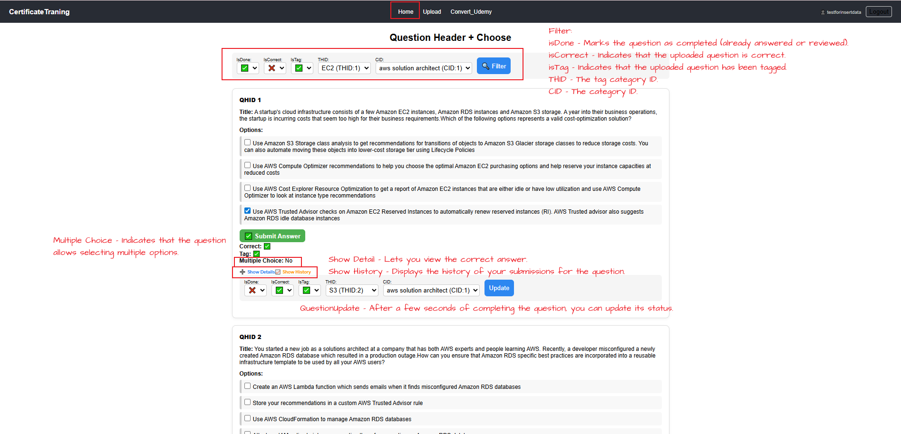
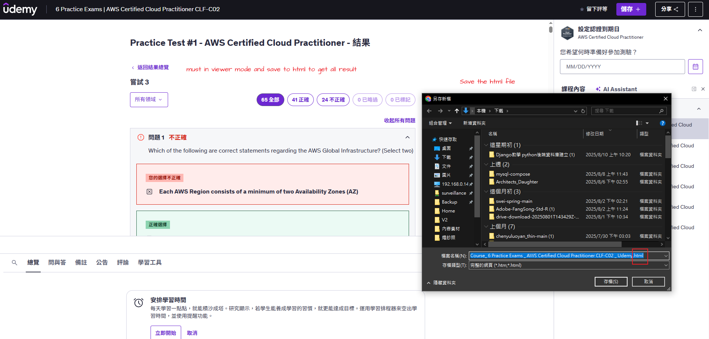
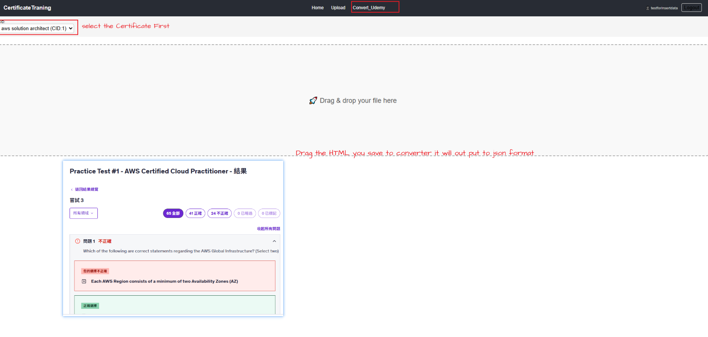
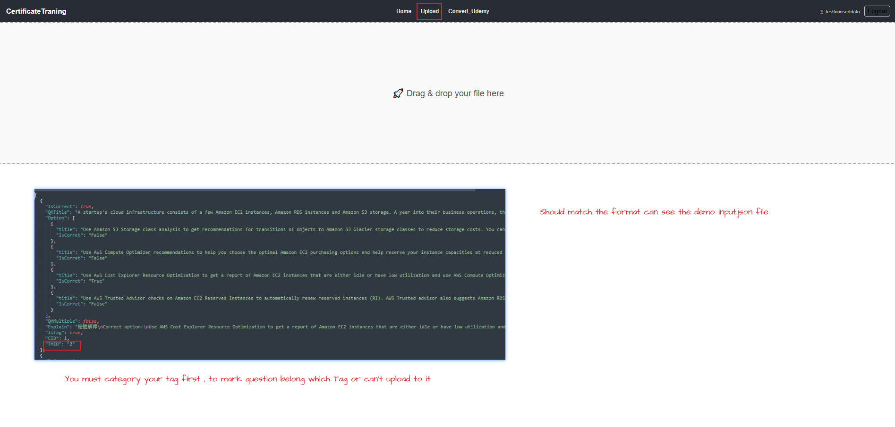
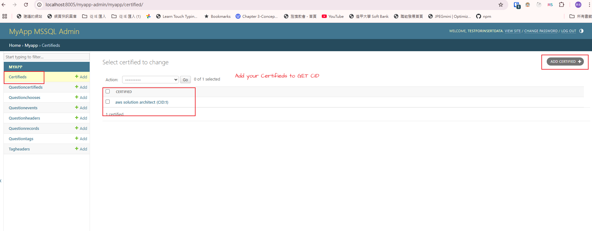
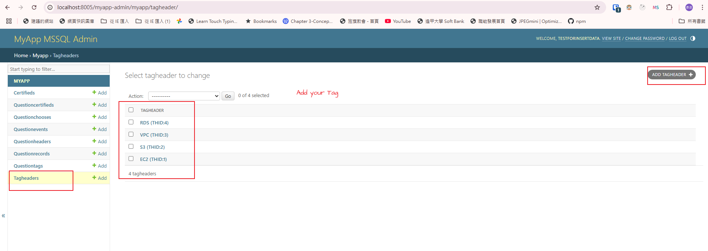
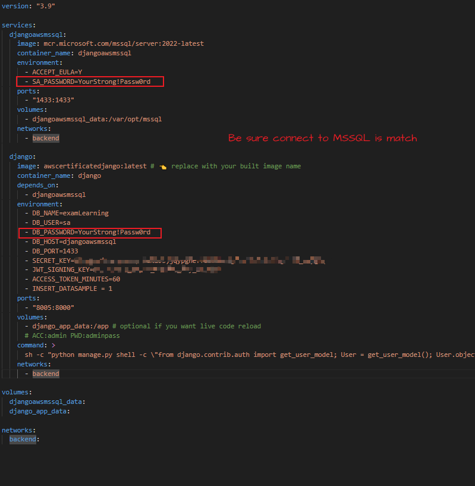
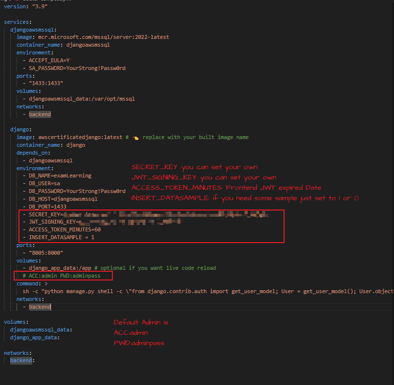

# Usage



## HTML converter





## Upload jsonfile



---

## Sample file

```
DemoData/Course_ Practice Exams _ AWS Certified Solutions Architect Associate _ Udemy.html

DemoData/input.json

```

---

# BackendURL

```
{URL}/myapp-admin/
{URL}/admin/
```

## Backend Insert Certifieds & TagHeaders





---

# DockerComposefile Setting





## Warning

HTML Converter – The current version only supports Udemy reports in Traditional Chinese.
Future updates may add more language options. To use it now, make sure your downloaded Udemy HTML report is in Traditional Chinese.
